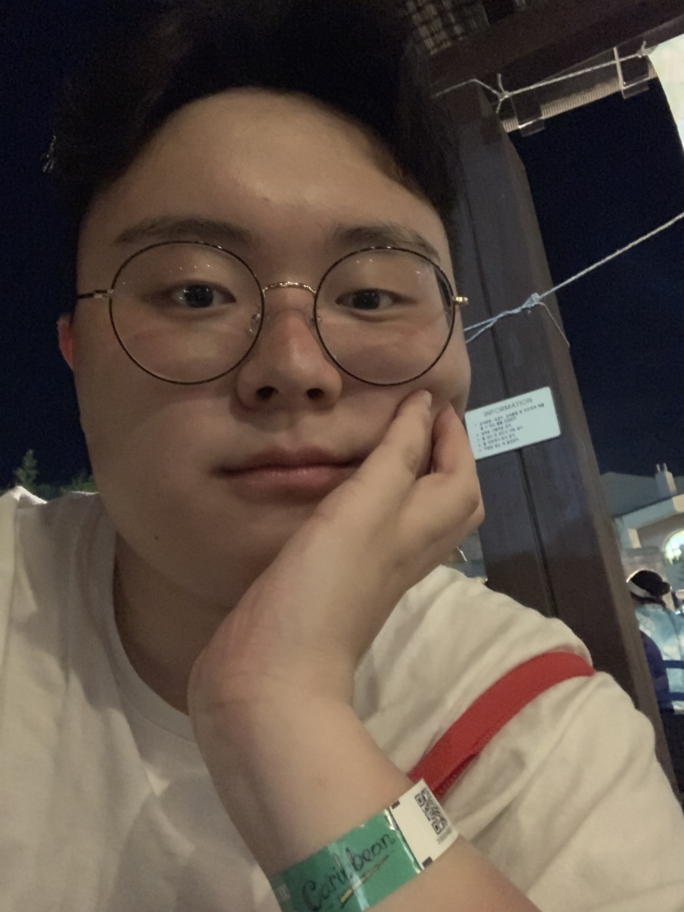

# 경력기술서

* 이름 : 김태성
* Email : kts6056@gmail.com
* Github : [github.com/kts6056](https://github.com/kts6056)
* 취미: 영화, 사격, 러닝, 사진, **카페코딩**, **코딩스터디**, **컨퍼런스 참가**
* 이력서 : <a href="./README.md">경력기술서</a>
## 자기소개
**“사교성 그것은 나를 표현하는 단어”**
> 저는 주변 사람들에게 사교성이 좋다고 많은 소리를 들었습니다. 그 이유는 제가 잘생겨서? 말솜씨가 뛰어나서? 둘 다 아닙니다. 아마 잘 웃는 성격과 저의 유머가 빛을 바랐던 거 같습니다. 저희 어머니의 입가에는 웃음이 항상 붙어 다녔습니다. 그것을 보며 자란 저는 아마 유전일지도 모르겠지만, 어릴 적부터 "웃음기가 많다”의 한 단어는 저와 떨어질 줄을 몰랐습니다. 그리고 어릴 적부터 사람들과 놀러 다니는 것을 좋아했습니다. 언제는 친구와 버스를 타고 시내를 둘러보고, 아파트 뒤에 있는 산을 등산도 하였고, 학교행사 중 장기자랑대회가 있으면 가장 먼저 손을 들어 친구와 함께 참여하였습니다. 다시 생각해보니 저의 인생은 잔잔하지 않았던 거 같습니다. 그 결과 웃는 인상은 상대방의 마음을 편하게 만들었고, 저의 활동력을 통하여 많은 경험은 물론이거니와 저의 사전에서 두려움과 쪽팔림 이 두 가지를 지울 수 있게 되었습니다. 밝은 성격과 무엇이든지 나서는 성격은 사내 직장동료와 화목한 분위기를 만들 뿐 아니라 팀의 능률을 향상시킬 수 있다고 생각합니다. 

## 성장과정
**“항상 역지사지의 입장으로“**
> 재학 중인 고등학교의 전통 중 하나가 체육대회를 시작할 때 과별로 응원전을 하는 것이 있습니다. 응원전을 시작할 때 각과마다 흔히들 부르는 과 춤을 보여줍니다. 그리하여 저를 포함한 각반의 임원들이 모였습니다. 과 춤은 개개인의 성격보단 성적을 먼저 생각하며 계획하였습니다. 춤을 잘 추며 따라오는 친구도 있었지만, 어떤 친구들의 경우 뻣뻣한 허리에 숙여지지 않는 허리에 신음을 내고, 몸이 약해 빠른 움직임에 부담을 가지는 친구도 있습니다. 모든 사람들이 춤꾼은 아니었습니다. 그래서 아이들의 시각에서 맞춰 다시 수정하고 가르치느라 힘들었던 기억이 납니다. 성과 위주에 생각이 치우쳐 다른 이의 처지를 생각하지 못하였던 거 같습니다. 그러나 성공을 위해서는 “역지사지”의 입장으로 해야 한다는 것을 알게 되었습니다. 이 교훈을 통하여 남을 먼저 생각하는 마음의 틀을 잡기 시작하였습니다.

## 입사후 포부
**“인재가 되기 위해 젊은 열정과 패기로 노력해 나아가다“**
> 입사 후 최고의 인재가 되기 위하여, 혁신과 창의적인 시도를 통해 경험으로 발전시키는 사람이 될 것입니다. 프로그램에 대해 문외한이었던 제가 불편함을 겪고, 그것을 해결하기 위해 계속해서 새로운생각과 발전을 하는 것처럼, 작은 혁신과 창의적인 시도가 조금씩 쌓여 경험이 되고, 후에는 든든한가치를 가지게 될 것이라 생각합니다. "역사상 최고"라는 목표는 그저 정해져 있는 기준입니다. 하지만 "저의 역사상 최대"는 제한되어 있지 않습니다.

## 특기사항
**"천재는 노력하는 자를 이길 수 없고 노력하는 자는 즐기는 자를 이길 수 없다"**
> 게임을 하다가 높은 레벨이 되면서 반복적인 행동을 해야 하는데 매번 같은 행동을 하는 것과 창의력을 요구하지 않는 부분이 만족스럽지 못하였습니다. 그러다가 오토핫키（매크로）라는 프로그램을 알게 되어 인터넷에서 찾아보며 배우기 시작했습니다. 처음이라 기초적인 지식이 없어서 다루기를 힘들었지만 하나씩 알아가는 재미로 배우다 보니 어느새 간단한 매크로 정도는 만들 수 있는 실력이 되었습니다. 처음으로 만들어 본 것을 인터넷에 올리고 공개를 해 보았습니다. 그리고 사용자의 의견을 듣고 프로그램에 하나씩 기능들을 추가해가는 재미로 즐거웠습니다. 그래서 좀 더 좋은 프로그램을 만들기 위해 전문적인 지식과 기술을 체계적으로 배우고자 특성화고등학교에 지원을 하고 입학을 하게 되었습니다. 학교에서는 ‘C’란 컴퓨터 언어를 처음으로 배우기 시작하였습니다. 배운 것을 제가 오토핫키로 만들어 본 프로그램처럼 만들기로 했습니다. 방과 후 활동을 통하여 매일 수업시간에 배운 것을 활용해 보고 새로운 지식에 대한 숙련도를 높여 나아갔습니다. 그 결과 저도 모르는 사이에 단편적인 것들이 서로 조합을 이루어 필요한 기능구현이 가능해졌고, 프로그램을 완성할 수 있었습니다. 그리고 학교시험에서도 A학점을 취득 했습니다. 아직도 배워야 할 것은 많지만 그래도 C언어에 대한 이해력이 높아졌고 프로그램을 만드는 성취감이 생겼습니다. 현재도 인터넷에 공개를 하고 사용자의 개선요구 사항을 듣고 기능 구현을 적용해 가고 있습니다. 이러한 활동을 통하여 카페의 사용자들과 원활한 의사소통 및 사용자의 만족감을 토대로 노력해 나아가고 있습니다.

## 동아리 활동
**"내가 아는 것을 남에게 나누다"**
> 지금까지 살면서 많은 봉사를 했습니다. 최근에는 NXT라는 교육용 로봇을 가지고 봉사를 시작했습니다. 대상은 안산시내 중학생들을 위한 직업체험교실 부스를 운영하는 것이었습니다. 저 자신에게는 뜻이 있는 봉사활동을 할 수 있는 계기가 되었습니다. 그렇게 시작된 봉사활동은 순탄하지 못하였습니다. 처음이라 서툴고 무엇을 가르쳐 주며 흥미를 이끌어 낼까? 고민도 많이 하였습니다. 검은색 선을 따라가는 로봇을 만드는 것으로 결정하였습니다. 그 결과 선을 따라가는 자신의 로봇을 보고 매우 만족하는 학생들의 모습을 보는 저희들은 무엇인가 마음에서 행복함이 느껴졌습니다. 진정한 봉사정신을 배운 것뿐만이 아니라 작은 행동이지만 그 결과는 결코 작지 않은 결과를 불러올 수 있다는 것을 알게 되었습니다. 