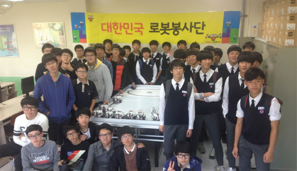
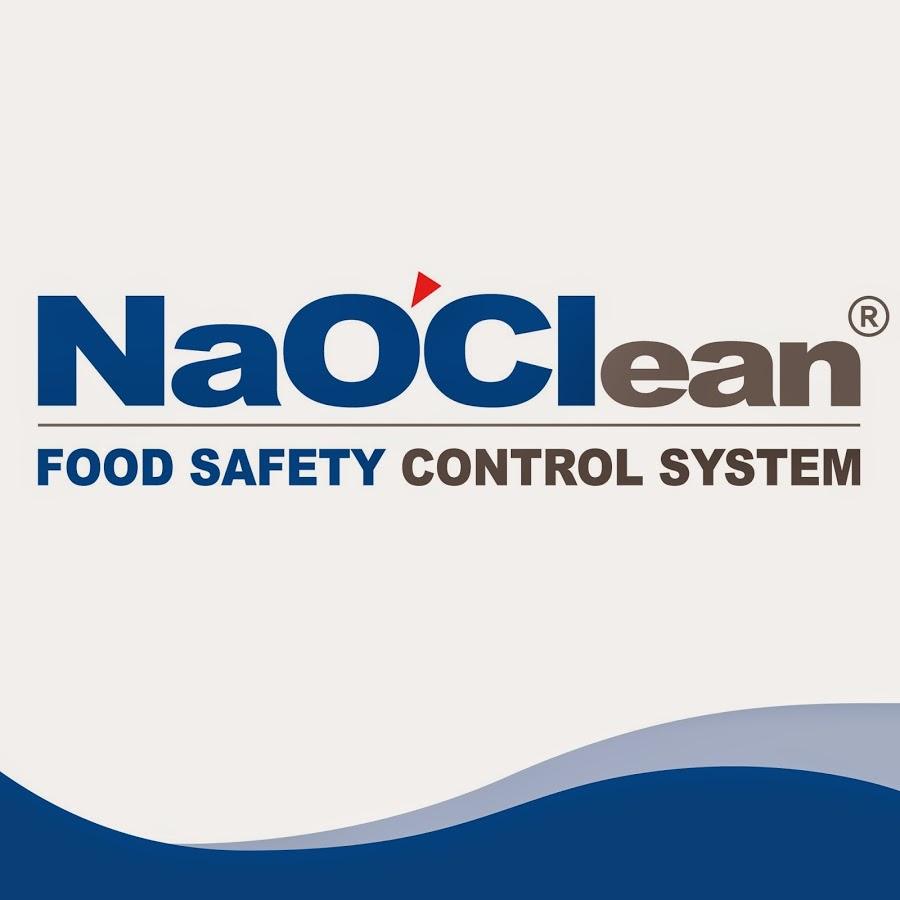
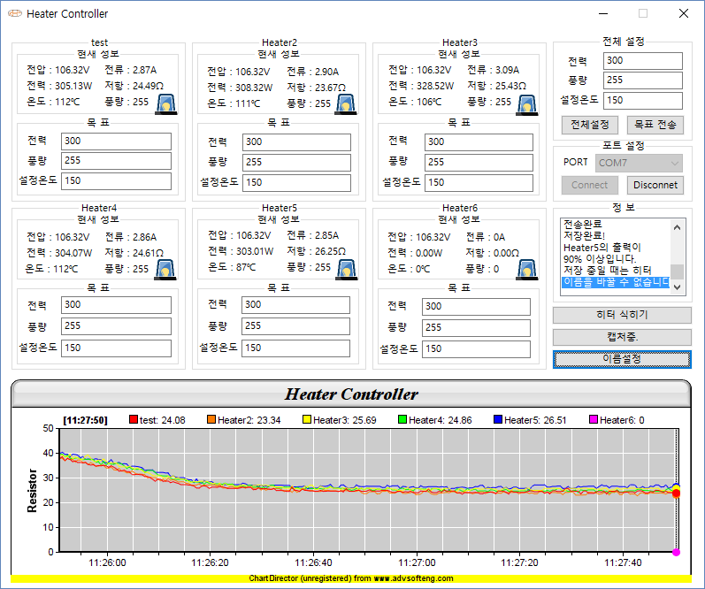
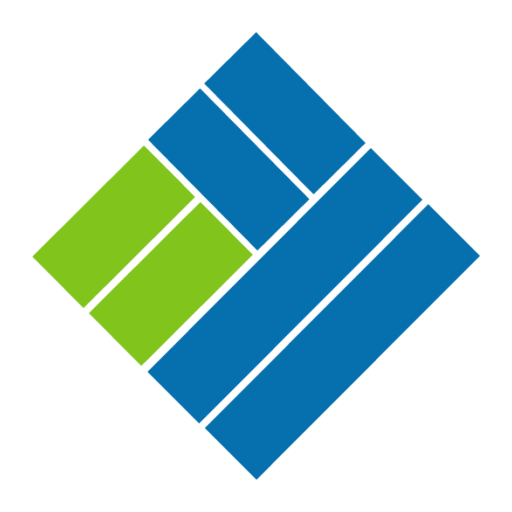

# 소개

* 이름 : 김태성
* Email : kts6056@gmail.com
* Github : [https://github.com/kts6056](https://github.com/kts6056)
* Blog : [https://kts6056.github.io](https://kts6056.github.io)
* 취미: 영화, 사격, 러닝, 사진, **카페코딩**, **코딩스터디**, **컨퍼런스 참가**
* 소개 : <a href="./ABOUT_ME.md">자기소개서</a>

입사 후 최고의 인재가 되기 위하여, 혁신과 창의적인 시도를 통해 경험으로 발전시키는 사람이 될 것입니다. 프로그램에 대해 문외한이었던 제가 불편함을 겪고, 그것을 해결하기 위해 계속해서 새로운생각과 발전을 하는 것처럼, **작은 혁신과 창의적인 시도가 조금씩 쌓여 경험이 되고, 후에는 든든한가치**를 가지게 될 것이라 생각합니다.

## 회사경력

* [유비스마트](http://ubsmart.co.kr/)
    - Android engineer, iOS engineer, Backend engineer
    - 기간 : 2018.05 ~ 재직중
* [디엔디전자](http://dndele.com)
    - Firmware engineer
    - 기간 : 2017.09 ~ 2018.05
* [담덕글로벌](http://damduk.co.kr/)
    - Android engineer
    - Firmware engineer
    - 기간 : 2015.08 ~ 2017.08

## 단체경력

* [대한민국로봇봉사단](http://robotvolunteer.com/)
    - 동아리 회장
    - 경기도 안산시 직업체험 학교 부스 운영 (LEGO(NXT, EV3) 로봇 프로그래밍 실습)
    - WRO 로봇올림피아드 전국대회 행사 스태프 참가
    - 기간 : 2013.03 ~ 2015.02

## 학력

- 안산공업고등학교 컴퓨터과 졸업 (2013.03 ~ 2016.02)

## 자격/수상

* 자격증 
  - 정보기기운용기능사
  - 정보기술자격(ITQ)한글엑셀 A등급
  - 정보처리기능사
* 수상
  - 2013년 학교장 표창 솔선수범상 - 안산공업고등학교
  - 2014학년도 7월 교내 모범학생 - 안산공업고등학교
  - 2014학년도 12월 교내모범학생 - 안산공업고등학교
  - 2015학년도 교내모범학생(봉사상) - 안산공업고등학교
  - 1학년 ~ 3학년 개근상 - 안산공업고등학교

## 사용기술

### Firmware

- C
- Serial
- Atmega
- CodeVision
- AtmelStudio

### Window

- C++
- AUtoHotkey
- MFC
- Winpcap
- WinSocket
- Serial
- [ChartDirector](https://www.advsofteng.com/)

### Android

- Java
- Kotlin
- Rx2Java
- MVVM Pattern
- AndroidFastNetwork
- Dagger2
- 기타 : glide, picasso, FCM, atto, Room...

## iOS

- Swift
- RxSwift
- RxAlamofire
- FCM

### Server

클라이언트에서 필요한 RESTful Api를 개발을 할 수 있습니다.
- Java - Tomcat(Ant)

### DB

RESTful에서 필요한 쿼리문을 작성할 수 있습니다.
- MariaDB

### Process

- 모니터링 
  - Firebase Crashlytics
  - Firebase Performance 
  - Firebase Analytics
- 커뮤니케이션
  - Slack
- 이슈관리
  - Github
- 버전관리
  - Git
  - GitFlow

### TODO

매번 **끊임없이 새로운 것을 습득**하기 위하여 노력하고 있습니다.
- Golang
- Vue.js
- Docker

## 프로젝트 이력

### UCOPS

- 회사 : [유비스마트](http://ubsmart.co.kr/)
- 소개 : 보안장비 신호 관제 서비스
- 플랫폼 : 
  - [Web - 관리자](https://ucops.kr)
  - [Android - 관리자](https://play.google.com/store/apps/details?id=kr.co.ubsmart.www.ucops_v2)
  - [Android - 사용자](https://play.google.com/store/apps/details?id=kr.co.ubsmart.integratedsurveillance)
  - [iOS - 사용자](https://apps.apple.com/kr/app/유캅스-고객용/id1473536577)
- 기간, 2018-10 ~ 진행중

### 911Security

- 회사 : [유비스마트](http://ubsmart.co.kr/)
- 소개 : 보안장비 신호 관제 서비스
- 플랫폼 : 
  - [Android](https://play.google.com/store/apps/details?id=kr.co.ubsmart.control911) - 관리자
- 기간, 2018-05 ~ 2018-08

### NaoClean

- 회사 : [디엔디전자](http://dndele.com)
- 소개 : 전해 살균수 제조장치
- 플랫폼 : 
  - Firmware
- 기간, 2017.09 ~ 2018.05

### (주)한카 국가과제

- 회사 : [담덕글로벌](http://damduk.co.kr)
- 소개 : 자동차 제어
- 플랫폼 : 
  - [Android](https://photos.app.goo.gl/P3bdypQoXvfYVEEf9)
- 기간, 2017.04

### CES 2017 현대자동차 스마트카 제작

- 회사 : [담덕글로벌](http://damduk.co.kr)
- 소개 : 485 통신을 통하여 의자 컨트롤
- 플랫폼 : 
  - Firmware
- 기간, 2016.12 ~ 2017-01

### 세라믹 히터 저항 측정기

- 회사 : [담덕글로벌](http://damduk.co.kr)
- 소개 : 세라믹 히터 저항 측정기
- 플랫폼 : 
  - Firmware
  - Windows
- 기간, 2016.02 ~ 2016-05

### 한테크 IoT 전기로

- 회사 : [담덕글로벌](http://damduk.co.kr)
- 소개 : 전기로 IoT 컨트롤러
- 플랫폼 : 
  - [Android](http://hantech98.com/%EB%89%B4%EC%8A%A4-%EA%B3%B5%EC%A7%80/?pageid=2&uid=194&mod=document)
  - Firmware
- 기간, 2015.11 ~ 2016-01

### ToLight

- 회사 : [담덕글로벌](http://damduk.co.kr)
- 소개 : 900 x 900 광섬유천 Lighting
- 플랫폼 : 
  - [Android](https://www.facebook.com/100003807619932/videos/825002907636622/)
  - Firmware
- 기간, 2015.09 ~ 2016-09